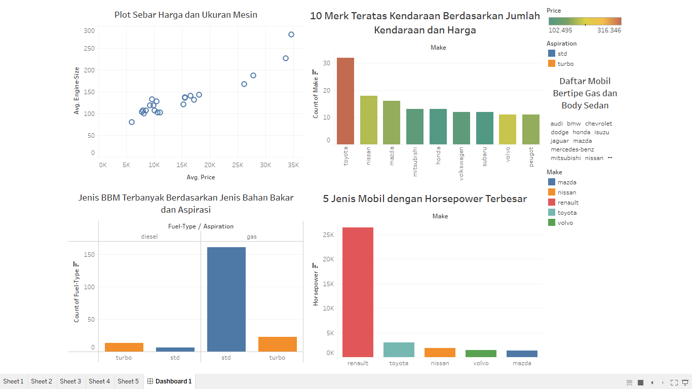

# Exploratory Data Analysis - Automobile

### [Code](/EDA%20Automobile.ipynb)

## Project Overview

When looking at vehicle prices, it’s easy to assume that higher prices simply mean better cars. But what actually drives those price differences? In this project, I explored an automobile dataset from Kaggle to understand how vehicle specifications and manufacturer characteristics influence pricing. The analysis started with cleaning and preparing raw data, followed by exploratory data analysis to uncover patterns in engine performance, price distribution, and manufacturer dominance.
Using Python for data analysis and Tableau for visualization, this project demonstrates how raw data can be transformed into clear insights. The findings reveal that engine size and manufacturer positioning play a significant role in determining vehicle prices, providing a data-driven perspective on the automotive market.

## Data Quality & Cleaning

Before diving into analysis, the dataset was examined to identify data quality issues that could impact results. This included checking for missing values, inconsistent data types, and extreme values.

**Insight — Missing Values**

Missing values in key columns were handled to preserve the size of the dataset while ensuring consistency across numerical variables used in analysis.

**Insight — Outliers**

Outliers were identified using statistical thresholds and removed to reduce skewness, allowing performance-related patterns to be observed more clearly.

## Distribution Analysis

To understand overall vehicle performance characteristics, univariate analysis was conducted using histograms to examine the distribution of horsepower values.

**Insight**

The horsepower distribution is right-skewed, indicating that most vehicles cluster around moderate performance levels, while high-performance vehicles represent a smaller portion of the dataset.

## Relationship Analysis

Bivariate analysis was performed to explore relationships between vehicle attributes and price. Engine size was selected as a key variable due to its strong correlation with performance.

**Insight**

A positive relationship is observed between engine size and price. As engine size increases, vehicle prices tend to rise, suggesting engine specifications play a significant role in pricing decisions.

## Market Insight

Manufacturer-level analysis was conducted to understand market composition and brand dominance within the dataset.

**Insight**

The dataset is largely dominated by mass-market manufacturers, indicating a stronger focus on high-volume, cost-efficient vehicle production rather than premium segments.

## Dashboard Visualization

To summarize findings and support insight exploration, cleaned data was visualized through an interactive Tableau dashboard.

**Insight**

The dashboard provides an integrated view of pricing, performance metrics, and manufacturer distribution, enabling faster identification of trends and comparisons.

## Conclusion

This project highlights the importance of data cleaning and exploratory analysis in uncovering meaningful patterns. By combining Python-based analysis with visualization tools, the project demonstrates a structured and practical approach to data analysis.
